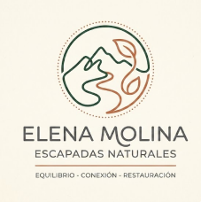
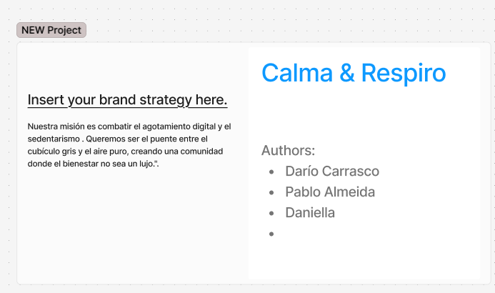
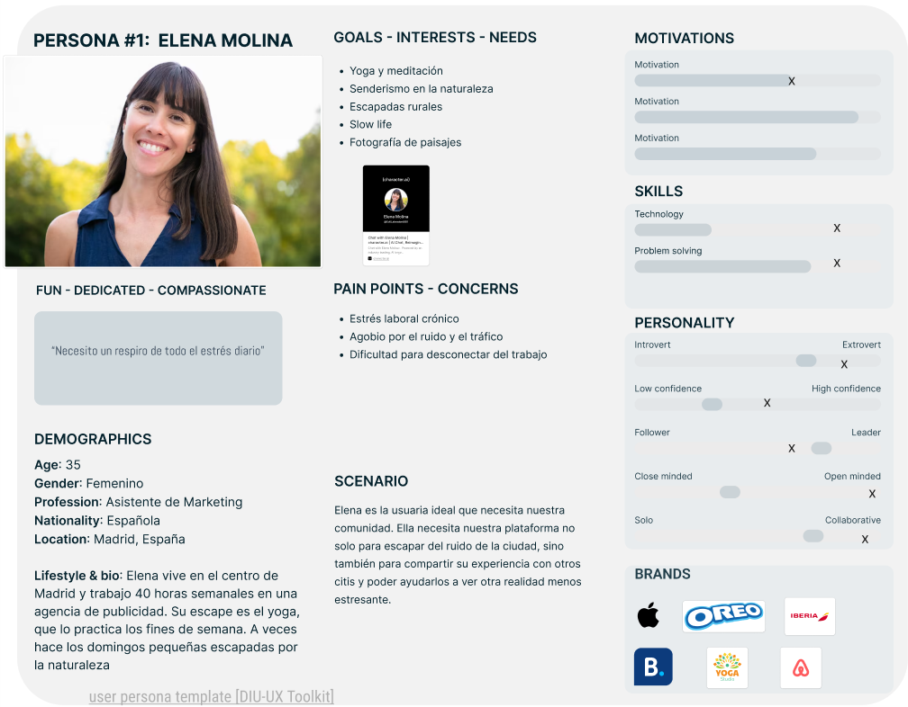
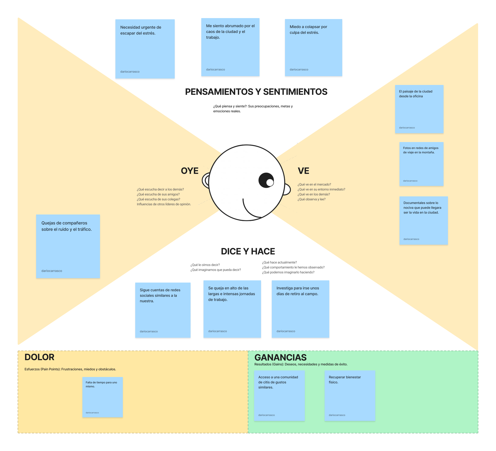
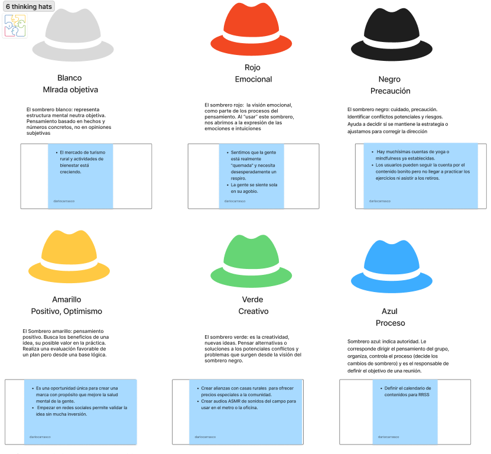
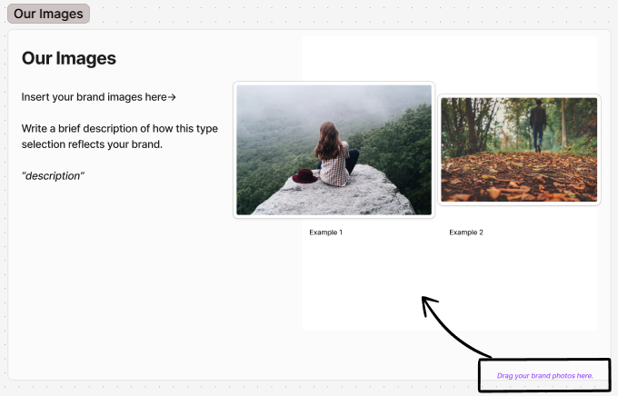
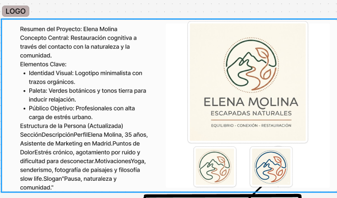
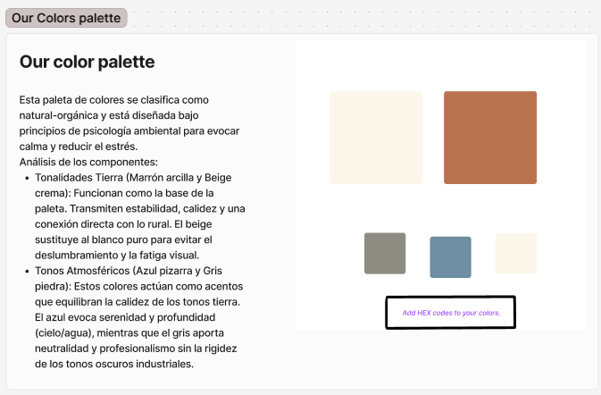
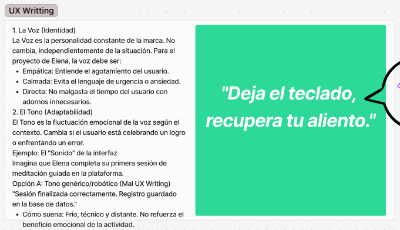

### ideapolis  
## proyecto: Elena Molina · Escapadas Naturales

Proyecto de Inteligencia Colectiva y Formación en la Empresa

Un proyecto planificado en [Ideapolis](https://github.com/mgea/ideapolis/)

[Master en Gestión y Tecnologías de Procesos de Negocio](https://masteres.ugr.es/mbagestiontic/)

ETS Ingeniería Informática y de Telecomunicación · Universidad de Granada

 
 

**Título** : Elena Molina · Escapadas Naturales

**Autores** : Darío Carrasco · Pablo Almeida · Daniella

**Resumen** : Comunidad online para profesionales urbanos con estrés crónico que buscan desconectar y reconectar con la naturaleza, la meditación, el senderismo y el *slow life*. Una plataforma para compartir escapadas, recursos de bienestar y experiencias restauradoras donde el bienestar deja de ser un lujo para convertirse en una práctica cotidiana.

**Logotipo** :

> *EQUILIBRIO · CONEXIÓN · RESTAURACIÓN*

**Slogan** : *Pausa, naturaleza y comunidad.*

**Hashtag** : `#EscapadasNaturales` · `#PausaNaturaleza`

**Licencia** : [Creative Commons Attribution-ShareAlike 4.0 International (CC BY-SA 4.0)](https://creativecommons.org/licenses/by-sa/4.0/)

**Fecha** : Mayo 2026

**Medios** (donde se tiene presencia):

* :octocat: [github.com/pablo0r/elena-molina](https://github.com/pablo0r/elena-molina)
* Instagram: `@escapadasnaturales`
* TikTok: `@escapadasnaturales`
* Newsletter (Substack): *Cartas desde el bosque*
* Meetup: *Escapadas Naturales · Encuentros mensuales*
* Landing Page: enlace a publicar (construida en Figma Make)

## ¿Quiénes somos?

Tres estudiantes del Máster en Gestión y Tecnologías de Procesos de Negocio (UGR) unidos por una misma preocupación: el agotamiento digital y la desconexión humana en las grandes ciudades. Hemos vivido en primera persona el cubículo gris, las jornadas eternas y la sensación de que el bienestar es un privilegio reservado para los fines de semana. Decidimos hacer algo al respecto.

### Misión

> **Combatir el agotamiento digital y el sedentarismo. Ser el puente entre el cubículo gris y el aire puro, creando una comunidad donde el bienestar no sea un lujo.**

*Manifiesto de la comunidad:*

1. La pausa también es productiva.
2. La naturaleza no es un destino, es una práctica.
3. Compartir el camino es la mejor parte del viaje.
4. El silencio es un derecho, no un privilegio.

#### Visión

Ser la red hispanohablante de referencia para el **bienestar restaurativo en naturaleza** para 2028, conectando profesionales urbanos con experiencias, mentores y comunidades locales que les ayuden a recuperar el equilibrio.

## Metodología

Metodología de desarrollo: **Diseño de contenidos digitales mediante estrategia de diseño de Experiencias de usuario (UX experiences)** apoyado en el marco de **Design Thinking** en cinco fases:

1. **Empatizar** — Mapa de empatía + entrevistas semiestructuradas.
2. **Definir** — Persona Elena Molina + DAFO.
3. **Idear** — Brainstorming + benchmark de comunidades similares.
4. **Prototipar** — Identidad visual, moodboard, landing page, redes sociales.
5. **Evaluar** — Test con usuarios, KPIs y cuestionarios SUS.

## Etapa 1: Ideación de proyecto

Actividades realizadas mediante Trello https://trello.com/b/3YjvDccp/proyectomultimedia y sesiones colaborativas en FigJam.

**¿Cómo surge el proyecto?**

Surge de una observación compartida tras la pandemia: el regreso a las oficinas no trajo bienestar, sino una nueva forma de agotamiento que combina lo peor del mundo digital (notificaciones constantes, reuniones encadenadas) con lo peor del mundo urbano (ruido, tráfico, falta de luz natural). Decidimos diseñar una comunidad que no vendiera "soluciones milagro" sino que ofreciera **pausa real, naturaleza accesible y compañía honesta**.

**Investigación de campo** — Desk research:

* [@LadyDistopia](https://twitter.com/LadyDistopia) — referente de crítica al hustle culture, voz cercana y honesta.
* Podcasts de mindfulness y *slow living* (Calma, Entiende tu mente).
* Cuentas Instagram de senderismo accesible (`@senderismomadrid`, `@montanasconsentido`).
* Estudios de la OMS sobre burnout (Clasificación CIE-11, 2019) y sedentarismo urbano.
* Comunidades similares: *Wild & Co*, *Slow Movement Spain*, *The Nature Fix* (libro de Florence Williams).

### Necesidad / oportunidad

**DAFO**

| | Internos | Externos |
|---|---|---|
| **Positivos** | **Fortalezas:** equipo multidisciplinar, foco en comunidad real (no solo app), narrativa cálida y diferenciada. | **Oportunidades:** auge del teletrabajo, sensibilidad creciente sobre salud mental, búsqueda de experiencias offline. |
| **Negativos** | **Debilidades:** sin presupuesto inicial, sin tracción previa, dependencia de redes sociales para distribución. | **Amenazas:** saturación del nicho wellness, competencia de apps grandes (Headspace, Calm), comoditización del concepto *mindfulness*. |

### Motivación de la propuesta

Porque creemos que **el bienestar no debería ser un producto premium**. Las apps de meditación más conocidas cuestan 70-90 €/año y ofrecen una experiencia solitaria. Nosotros queremos lo contrario: una comunidad gratuita en su capa básica, con experiencias compartidas y mentoría entre pares.

La frase que resume nuestra motivación es:

> *"Deja el teclado, recupera tu aliento."*

### Personas / Usuarios

Una **persona de usuario** es un arquetipo ficticio, pero construido a partir de datos reales, que representa al segmento principal al que queremos servir. Sintetiza demografía, motivaciones, frustraciones y comportamientos en un personaje único con nombre, cara y voz. Sirve como "norte" para todas las decisiones de diseño, comunicación y producto: cada vez que el equipo duda —¿este tono es demasiado técnico?, ¿este precio es viable?, ¿una escapada de 12 km es accesible?— preguntamos «¿qué haría Elena?» en vez de adivinar.

Diseñamos nuestra persona principal apoyándonos en **Character.AI** (para iterar diálogos y validar la coherencia de su personalidad) y en entrevistas con perfiles reales del entorno cercano del equipo.

> *Ficha de persona elaborada sobre la plantilla del DIU-UX Toolkit de la Universidad de Granada. La fotografía es representativa y no corresponde a una persona real.*

**Elena Molina** — 35 años, Asistente de Marketing en Madrid. Trabaja 40 h/semana en una agencia de publicidad. Su escape actual es el yoga los fines de semana y, ocasionalmente, escapadas dominicales por la naturaleza.

* **Pain points:** estrés laboral crónico, agobio por el ruido y el tráfico, dificultad para desconectar del trabajo.
* **Goals:** yoga y meditación, senderismo, escapadas rurales, *slow life*, fotografía de paisajes.
* **Quote:** *"Necesito un respiro de todo el estrés diario."*
* **Marcas afines:** Apple (diseño con propósito) · Oreo (tradición cálida) · Iberia (escapadas) · Booking (planificación) · Yoga Studio (práctica diaria) · Airbnb (alojamientos con alma). Esta paleta de afinidades guió decisiones de tono visual y elección de referentes.

**Por qué Elena y no otra persona.** Representa el segmento mayoritario de nuestro público objetivo según las entrevistas previas: profesional urbano de 30-40 años, alta carga cognitiva, capacidad de pago moderada, ya practica algo de bienestar de forma intermitente pero busca más comunidad y menos soledad digital. Si la propuesta resuena con Elena, resonará con la mayor parte del target inicial.

### Mapa de empatía

El **mapa de empatía** es una herramienta de Design Thinking (popularizada por XPLANE y Dave Gray) que organiza lo que un usuario *oye*, *ve*, *piensa y siente* y *dice y hace*, además de sus *dolores* y *ganancias* esperadas. A diferencia de la persona —que es estática y biográfica— el mapa de empatía sitúa al usuario en su contexto cotidiano y nos obliga a meternos dentro de su cabeza. Lo construimos en sesión colaborativa, con post-its sobre **FigJam**, partiendo de los datos de la persona y de las entrevistas previas.

> *Mapa de empatía elaborado en FigJam por el equipo, basado en los datos de la persona Elena Molina y entrevistas semiestructuradas.*

Síntesis textual de los seis cuadrantes:

* **Oye:** consejos de amigos sobre retiros rurales · podcasts de meditación · quejas de compañeros sobre el ruido y el tráfico.
* **Ve:** el paisaje de la ciudad desde la oficina · fotos en redes de amigos en la montaña · documentales sobre lo nociva que puede ser la vida en la ciudad.
* **Piensa y siente:** necesidad urgente de escapar del estrés · sentimiento de agobio por el caos urbano · miedo a colapsar.
* **Dice y hace:** se queja de las jornadas largas · sigue cuentas afines en redes · investiga retiros rurales.
* **Dolor (Pain Points):** agotamiento físico y mental · falta de tiempo para sí misma.
* **Ganancias (Gains):** acceso a una comunidad de iguales · recuperar el bienestar físico y mental.

**Insight clave que extrajimos del mapa.** Elena no necesita *más* información (ya consume podcasts, documentales, cuentas) — necesita **acción asistida en compañía**. Esto reorientó la propuesta desde "otra app de contenido" hacia "comunidad + escapadas presenciales", que es justamente lo que diferencia a Escapadas Naturales del nicho saturado de wellness apps.

### Seis Sombreros para Pensar

Antes de pasar a prototipar, aplicamos la metodología **"Seis Sombreros para Pensar"** de Edward de Bono para forzarnos a examinar el proyecto desde seis ángulos distintos y desbloquear puntos ciegos. Cada sombrero representa una *modalidad de pensamiento* que el equipo "lleva puesta" durante un rato, evitando que la conversación se enrede entre marcos incompatibles (lo emocional contra lo lógico, lo creativo contra lo analítico). Lo dinamizamos en **FigJam** con un facilitador rotativo y rondas cronometradas de 8 minutos por sombrero.

> *Sesión de Seis Sombreros aplicada al proyecto, facilitada por Darío Carrasco sobre FigJam.*

Lo que surgió en cada sombrero:

| Sombrero | Modalidad de pensamiento | Conclusión del equipo |
|---|---|---|
| ⚪ **Blanco** | Datos objetivos y hechos | El mercado de turismo rural y actividades de bienestar está creciendo de forma sostenida. |
| 🔴 **Rojo** | Emoción e intuición | Sentimos que la gente está realmente "quemada" y necesita desesperadamente un respiro. La gente se siente sola en su agobio. |
| ⚫ **Negro** | Precaución y riesgos | Hay muchísimas cuentas de yoga y mindfulness ya establecidas. Los usuarios pueden seguir la cuenta por el contenido bonito pero no llegar a practicar los ejercicios ni asistir a los retiros. |
| 🟡 **Amarillo** | Optimismo y beneficios | Es una oportunidad única para crear una marca con propósito que mejore la salud mental de la gente. Empezar en redes sociales permite validar la idea sin mucha inversión. |
| 🟢 **Verde** | Creatividad y alternativas | Crear alianzas con casas rurales para ofrecer precios especiales a la comunidad. Crear audios ASMR de sonidos del campo para usar en el metro o en la oficina. |
| 🔵 **Azul** | Proceso y dirección | Definir el calendario de contenidos para RRSS como primer entregable y rotar el rol de facilitador en cada sesión del equipo. |

**Decisiones concretas que disparó este ejercicio:**

1. La amenaza del sombrero **negro** (apps con buen marketing pero baja conversión a práctica real) nos llevó a desplazar el énfasis hacia los **encuentros presenciales** como diferenciador imposible de imitar por una app.
2. La idea creativa del sombrero **verde** —audios ASMR del campo— entra en el roadmap como **producto secundario gratuito** de la newsletter: un micro-recurso descargable que refuerza el hábito de pausa en plena ciudad.
3. El sombrero **amarillo** validó la secuencia de lanzamiento: **redes sociales → newsletter → comunidad WhatsApp → escapadas presenciales**, escalando sólo cuando hay tracción demostrada en la fase anterior.

## Etapa 2: Prototipar / productos

* **Imagen visual — moodboard**

  Herramienta: **Figma Make** + curación manual.

  

  El moodboard prioriza fotografía analógica, tonos terrosos, niebla matinal, senderos forestales y figuras humanas a contraluz. Evitamos imágenes corporativas, gente sonriendo a cámara y *lifestyle* aspiracional.

* **Identidad visual**

  

  * Logotipo: trazos orgánicos, montaña + hoja, símbolo abierto y femenino.
  * Tipografía: serif humanista para titulares + sans neutra para cuerpo.
  * Paleta cromática (clasificada como *natural-orgánica*, diseñada bajo principios de psicología ambiental para evocar calma y reducir el estrés):

    

    | Color | HEX | Uso |
    |---|---|---|
    | Marrón arcilla | `#A0522D` | Acento cálido, CTAs |
    | Beige crema | `#F5EBDD` | Fondo principal |
    | Azul pizarra | `#4A6572` | Tipografía, atmósfera |
    | Gris piedra | `#7D7B77` | Texto secundario, separadores |

* **UX Writing — Voz y tono**

  

  * **La voz (identidad):** empática, calmada, directa. No malgasta el tiempo con adornos innecesarios.
  * **El tono (adaptabilidad):** fluctúa según el contexto. Celebra logros, acompaña errores.
  * **Ejemplo malo:** *"Sesión finalizada correctamente. Registro guardado en la base de datos."* → frío, técnico, no refuerza el beneficio.
  * **Ejemplo bueno:** *"Has regalado 10 minutos a tu cabeza. Mañana te esperan otros 10."* → cálido, humano, reconoce el esfuerzo.

* **Redes sociales**

  * Instagram (`@escapadasnaturales`): 3 publicaciones/semana — frases, fotografías, *carruseles* educativos.
  * TikTok: 1 vídeo semanal — escapadas reales, micro-rituales de pausa.
  * Newsletter Substack: quincenal — ensayo corto + recomendación de escapada.

* **Publicidad / promoción — Landing Page**

  Construida en **Figma Make** con prompt optimizado. Headline: *"Deja el teclado, recupera tu aliento."* CTA primario: *"Únete gratis."* Conversion-focused, mobile-first.
  https://hidden-award-89003549.figma.site/

  * **Personaje**
https://character.ai/chat/evVZlQdonlxPNB3nDtpqJ7oIF4ZLJ4GbT41w4m5NfwQ

* **Proyecto — grado de conclusión**

  MVP visual + identidad de marca completa + dos páginas en Figma Make publicadas. Comunidad Elgg pendiente de configurar en la siguiente iteración.

## Etapa 3: Producción y evaluación

### Estrategia para diseñar comunidad

* **Arranque:** 5 usuarios piloto reclutados del entorno cercano + una escapada presencial trimestral en la Sierra de Madrid.
* **Capa básica gratuita** + capa premium futura con escapadas guiadas con mentor.
* **Co-creación:** los primeros 50 miembros participan en la definición de las normas de la comunidad.

### Indicadores de éxito (KPIs)

| KPI | Meta a 6 meses |
|---|---|
| Suscriptores newsletter | ≥ 500 |
| Engagement Instagram | ≥ 5 % |
| NPS comunidad | ≥ 40 |
| Retención mensual | ≥ 60 % |
| Escapadas presenciales | ≥ 2 |

### Test con usuarios

* Entrevistas semiestructuradas (n = 8) tras la primera escapada piloto.
* Cuestionario SUS (System Usability Scale) sobre la landing.
* *Card sorting* para validar la arquitectura de información de la futura plataforma.

### Preguntas frecuentes

* **¿Hay que pagar?** No. La comunidad y la newsletter son gratuitas.
* **¿Hay que ser deportista?** No. La pausa es para todos.
* **¿Funciona si vivo fuera de Madrid?** Sí. La newsletter y el contenido online son nacionales; las escapadas presenciales se expandirán por demanda.

## Conclusiones y trabajo futuro

* **Grado de consecución:** identidad de marca cerrada, plantilla de proyecto publicada, dos páginas Figma Make generadas, repositorio público abierto.
* **Problemas identificados:** dificultad para diferenciarnos del nicho wellness saturado · sin presupuesto para fotografía propia (uso temporal de stock) · tiempo limitado del equipo.
* **Propuestas de mejora:** validar la propuesta con 20 entrevistas adicionales · contratar fotografía propia · construir la comunidad en Elgg con login social.
* **Posible interés del proyecto:** profesionales de RR. HH. preocupados por el burnout · psicólogos clínicos · ayuntamientos rurales que quieran promover turismo restaurativo · marcas con afinidad (deportes outdoor, alimentación saludable).

Tres aprendizajes finales: **pausa como producto**, **comunidad como canal**, **naturaleza como diferencial**.

## Referencias y recursos

* [Proceso UX](https://uxmastery.com/resources/process/)
* [Diseño de Experiencias UX](http://www.nosolousabilidad.com/articulos/uxd.htm)
* [Métodos UX](https://mgea.github.io/UX-DIU-Checklist/index.html)
* [MuseMap: ejemplo de experiencia UX](https://blog.prototypr.io/musemap-street-art-app-ux-case-study-9bec6a99823b)
* OMS — *Burnout: una "enfermedad profesional"* (CIE-11, 2019).
* Cal Newport — *Deep Work* (Grand Central Publishing, 2016).
* Florence Williams — *The Nature Fix* (W. W. Norton, 2017).
* DIU-UX Toolkit, Universidad de Granada.
* Figma Make — herramienta de diseño generativo asistido por IA.
* Character.AI — diseño de persona conversacional.

---

Granada, Mayo 2026
